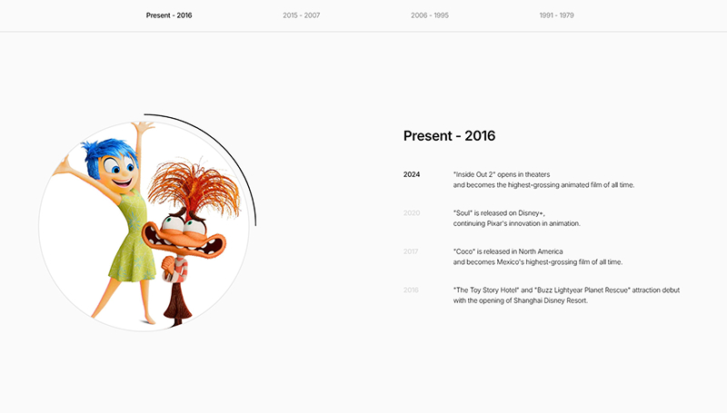

# circular-heritage
4-section circular scroll experience built with GSAP - heritage storytelling

## Preview


## Features
- 4-section circular layout
- Smooth scroll transitions
- GSAP-powered animations
- Heritage timeline storytelling

## Tech Stack
- HTML/CSS/JavaScript
- GSAP (GreenSock Animation Platform)

## Demo
🔗 [Live Demo](https://circular-heritage.netlify.app)

## Installation
```bash
git clone https://github.com/your-username/circular-heritage.git
cd circular-heritage
# serve locally or open index.html